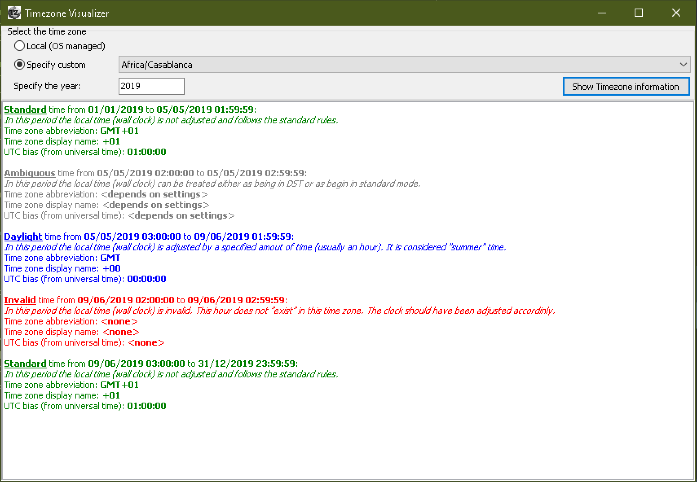

TZDB - IANA Time Zone Database for Delphi/FreePascal
===========

## Introduction

**TZDB** is an offline, in-process compiled database for  IANA's (https://www.iana.org/time-zones) TZDB project.

The source code is compatible with **Delphi XE+** and **FreePascal 3+**, though some components are only available for Delphi.

The current version of TZDB is compiled with **2019c** version of IANA TZDB and the latest Windows alias translation table (from CLDR project).

[API Documentation](https://github.com/pavkam/tzdb/wiki/API-Documentation) and [Code Examples](https://github.com/pavkam/tzdb/wiki/Code-Examples). 

## Using the Library

To use TZDB you only require one file: [TZDB.pas](https://raw.githubusercontent.com/pavkam/tzdb/master/dist/TZDB.pas). Download it and simply add it to your `uses` clause. This unit contains the whole pre-compiled TZ database and all the code required to interpret it.

All the other files in the project are optional.
After you download the files to your local project, simply include the TZDB unit in the `uses` clause.

Simplest example looks like:

```pascal
uses TZDB;

begin
  LTimeZone := TBundledTimeZone.GetTimeZone('Africa/Cairo');
  WriteLn(LTimeZone.ToUniversalTime(Now));
end.
```

A large number of methods are provided on the `TBundledTimeZone` class that allow date/time manipulation.

## Things of Interest

There are a large number of misconceptions when it comes to time zones in general. And TZDB tries to deal with them in specific ways. The following list should shed some light on issue one might encounter during the use of this library:

* `TBundledTimeZone.Create` accepts both normal timezone IDs as well as Windows aliases such as `European Standard Time`. The method will throw an `ETimeZoneInvalid` if the given ID is unknown.
* All methods that take date/times might throw an`EUnknownTimeZoneYear` exception. This can happen if one supplies a date/time that is not covered by the database. Example would be a date in `1800s` when such data is not available. One needs to catch such exceptions pro-actively.
* All methods that take local time accept an optional parameter called `AForceDaylight` that defaults `true`. This is due to local times potentially being ambiguous in some time periods (between daylight time and standard time, there is an hour (s) that appear twice). This argument allows the code to assign the hour to either the daylight period or the standard period.
* Methods might throw `ELocalTimeInvalid` exception if the give local time is in the invalid period (between standard time and daylight time there is the missing hour(s)). Use `GetLocalTimeType` to check the type of the local time before trying to operate on it.
* There is no guarantee that a time zone supports daylight time. Use `HasDaylightTime` to detect whether this is the case.
* Some time zones include multiple daylight periods so do not assume there is only one. This might throw methods such as `AmbiguousTimeStart` or `StandardTimeStart` off.
* Do not rely on `DisplayName`, `Abbreviation` and especially `UtcOffset` properties of the `TBundledTimeZone` class. These are provided for information only and will change during the year.

## Time Zone Visualizer

The Time Zone Visualizer is a development tool we use to display time zone details. It is currently only supported on Windows:


